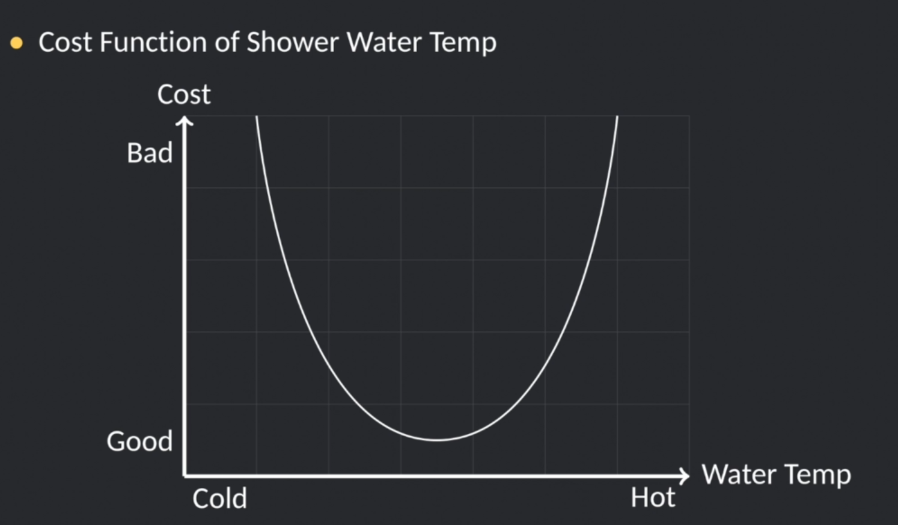
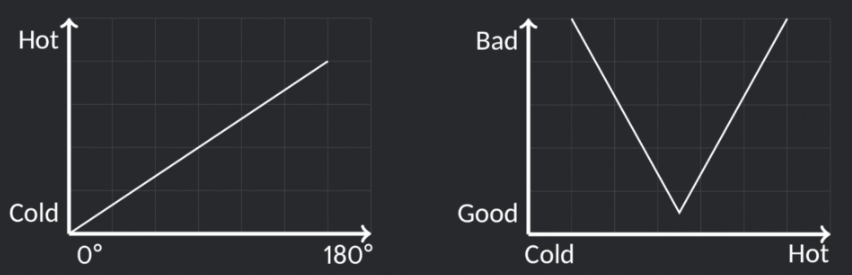
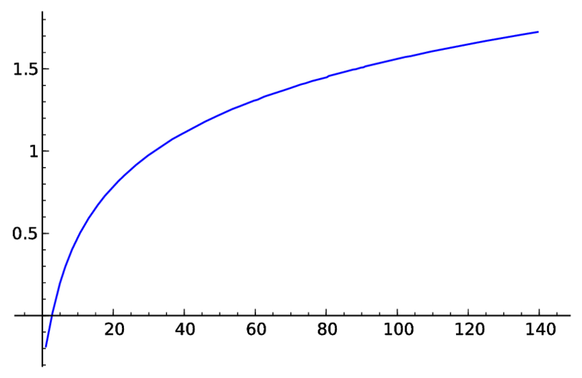

## MPC Kurs Notları

* **Model**, verilen inputlara göre sistemin nasıl tepki vereceğini tanımlar.
    - Vananın dönme açısına göre suyun sıcaklığı ne kadar değişecek?
* **Maliyet fonksiyonu** (cost function), sistemin durumunun ne kadar arzu edilebilir olduğunu tanımlar.
    - Duş alırken, farklı su sıcaklıklarında nasıl keyif aldığımız. Parabolun alt noktası tam ılık su sıcaklığında (benim için çok iyi bir sıcaklık değeri) ve cost fonksiyonu çok az. Yani cost fonksiyonu ne kadara az ise o kadar iyi.
    
* Eğer modelimize ve maliyet fonksiyonumuza **optimizer** verirsek,optimizer hangi inputun istenilen sistem durumuna daha çok yaklaşacağını hesaplar.

### Ödev 0
Bu ödevin amacı basit bir örnek ile MPC'yi tanıtmaktır.
* Aşağıda verilen model ve cost fonskiyonuna göre optimizasyon uygulayabilir misiniz?

T = 0.5 · θ

Cost = |T-40|

En iyi girdi (θ) = 80 
* Sistemi iyileştirmek istiyorsak en düşük cost değerini elde etmeye çalışırız.

**Eğer su çok soğuk akıyorsa ve vanayı aniden sıcak tarafa çevirdiğinizde suyun sıcaklığı aniden değişir mi?**
    
* Muhtemelen suyun sıcaklığı aşağıdaki grafikteki davranışı sergileyecektir (logarithmic growth).

*Peki 10 saniye sonra ideal vana açısı ne olmalı?*

**Duş Dinamiği 🚿**

θ=80 -> T = 40 -> Cost = 0 

*Şimdi farklı zaman aralıklarındaki değişimleri inceleyelim*

- t=0, θ=80 -> T=0 -> Cost=40
- t=1, θ=80 -> T=20 -> Cost=20
- t=2, θ=80 -> T=30 -> Cost=10
- t=3, θ=80 -> T=35 -> Cost=5

Yukarıda görüldüğü gibi vanayı 80 derece yaptıktan sonra suyun sıcaklığının artışını görebiliyoruz. Aynı zamanda maliyet (cost) değerimiz azalıyor yani istenilen optimal değere daha çok yaklaşıyoruz.
